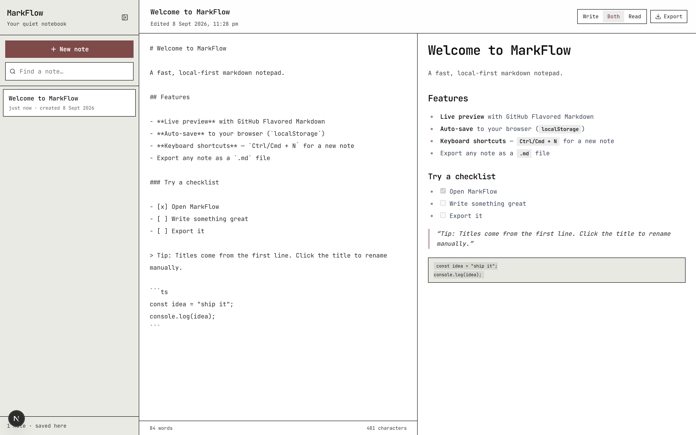
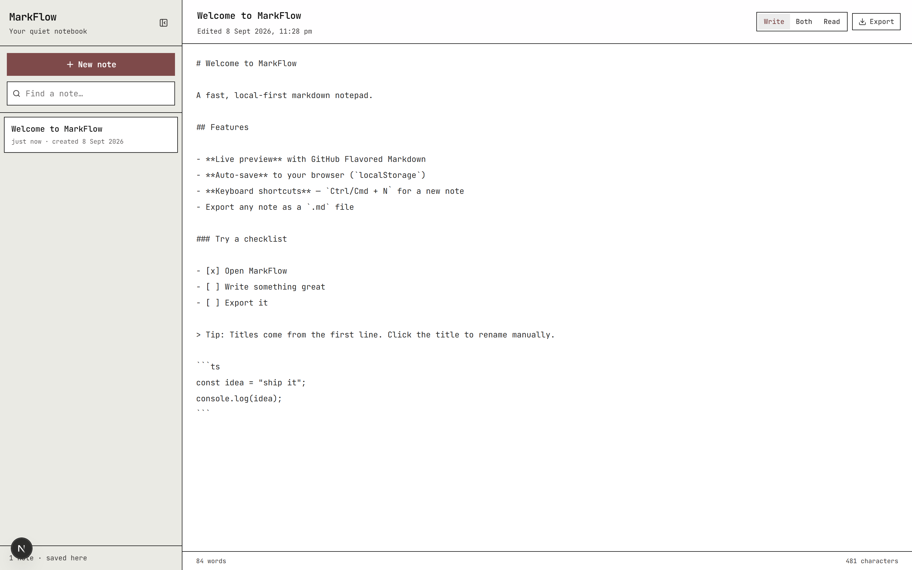
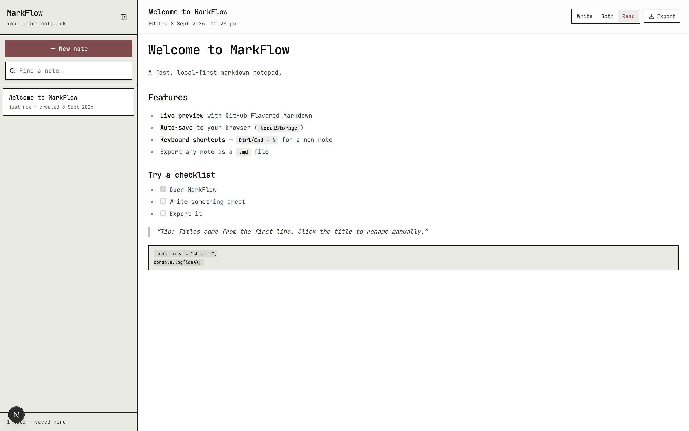
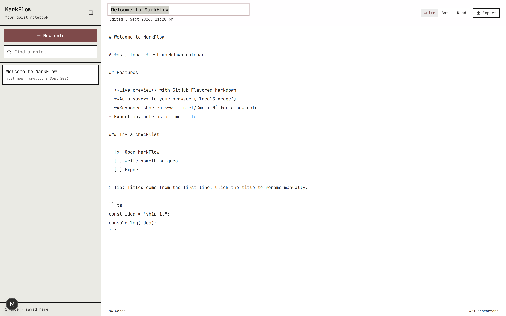

# MarkFlow

A local-first markdown notepad for the browser. MarkFlow provides a distraction-free writing environment with live GitHub Flavored Markdown preview, debounced autosave, and zero backend dependencies — all notes persist in the browser's `localStorage`.

## Screenshots

### Split View — Editor and Live Preview

Default workspace layout with the markdown source on the left and the rendered GFM preview on the right.



### Editor — Focus Mode

Dedicated writing mode with monospace input and real-time word and character counts.



### Preview — Reading Mode

Rendered output with full GFM support: tables, task lists, fenced code blocks, and styled blockquotes.



### Inline Title Editing

Note titles are derived automatically from the first markdown line and can be renamed in place from the toolbar.



## Features

- **Split editor and live preview** — Three view modes (Write / Both / Read) with instant GFM rendering via `react-markdown` and `remark-gfm`.
- **Local-first persistence** — Notes are serialized to `localStorage` under a versioned key (`markflow.notes.v1`) with 350 ms debounced writes and a flush-on-unmount guard against data loss.
- **Automatic title derivation** — Note titles are parsed from the first heading, list marker, or blockquote line; manual renames lock the title until explicitly reset to auto-derivation.
- **Sidebar management** — Collapsible sidebar with real-time search across titles and content, last-modified sorting, and two-click delete confirmation.
- **Responsive layout** — The workspace automatically falls back from split view to editor-only mode on viewports at or below 768 px via a `matchMedia` listener.
- **Markdown export** — Single-note export to a sanitized `.md` filename via the `Blob` / object-URL download API.
- **Keyboard shortcuts** — Global `Ctrl/Cmd + N` for note creation, registered through a reusable shortcut hook that skips events originating from editable targets.
- **Writing statistics** — Live word and character counts in the editor footer.
- **SSR-safe hydration** — `localStorage` reads occur post-mount to prevent Next.js hydration mismatches.

## Technology Stack

| Layer            | Technology                                    |
| ---------------- | --------------------------------------------- |
| Framework        | Next.js 16 (App Router, Turbopack)             |
| UI Library       | React 19                                       |
| Language         | TypeScript 5                                   |
| Styling          | Tailwind CSS 4 + `@tailwindcss/typography`     |
| Markdown Parsing | `react-markdown` + `remark-gfm`                |
| Icons            | `lucide-react`                                 |
| Typography       | Figtree, Source Serif 4, JetBrains Mono        |

## Prerequisites

- Node.js 18.18 or later
- npm 9 or later

## Installation

```bash
# Clone the repository
git clone <repository-url>
cd markflow

# Install dependencies
npm install
```

## Usage

### Development

```bash
npm run dev
```

The application runs at [http://localhost:3000](http://localhost:3000). Turbopack enables hot module replacement with sub-second rebuild times.

### Production Build

```bash
npm run build
npm run start
```

### Linting

```bash
npm run lint
```

## Keyboard Shortcuts

| Shortcut      | Action          |
| ------------- | --------------- |
| `Ctrl/Cmd + N` | Create new note |

Shortcuts operate globally but are intentionally registered only after client hydration completes.

## Project Structure

```
src/
  app/                 # Next.js App Router shell (layout, page, global styles)
  components/          # Presentational components (Sidebar, Workspace, Editor, Preview, Toolbar)
  hooks/               # useLocalStorage, useNotes, useKeyboardShortcuts
  lib/                 # Note utilities (CRUD helpers, title derivation, markdown export)
  types/               # Note and NotesStore type definitions
docs/
  screenshots/         # Application screenshots referenced in this README
```

### Architecture Overview

- **`NotesApp`** — Root client component; owns note state and global shortcuts.
- **`Sidebar`** — Note list, search, create/delete actions, and collapse toggle.
- **`Workspace`** — View-mode orchestration with responsive fallback behavior.
- **`Editor` / `Preview`** — Controlled textarea and GFM rendering panes.
- **`Toolbar`** — Inline title editing, view-mode switcher, and export control.
- **`useNotes`** — Domain hook encapsulating all CRUD operations and the persistence boundary.
- **`useLocalStorage`** — Generic SSR-safe storage hook with debounced writes and unmount flush.

## Data Model

```typescript
interface Note {
  id: string;
  title: string;              // Auto-derived from first markdown line unless manually set
  content: string;            // Raw markdown body
  titleManuallySet: boolean;  // Suppresses auto-title derivation when true
  createdAt: number;          // Unix milliseconds
  updatedAt: number;          // Unix milliseconds
}
```

All notes are stored as a single JSON document under the `markflow.notes.v1` `localStorage` key. Storage quota constraints apply (typically 5 MB per origin, sufficient for several thousand plain-text notes).

## Browser Support

Requires `localStorage`, `crypto.randomUUID`, and the `Blob` download API. Supported in all evergreen browsers (Chrome, Edge, Firefox, Safari).

## Roadmap

- Folder and tag-based organization
- Import of existing `.md` files
- Multiple export formats (HTML, PDF)
- Optional cloud sync with end-to-end encryption
- Dark mode theme

## Contributing

Contributions are welcome. Please open an issue to discuss proposed changes before submitting a pull request. Ensure `npm run lint` and `npm run build` pass before submission.

## License

Distributed under the MIT License. See [`LICENSE`](LICENSE) for details.
